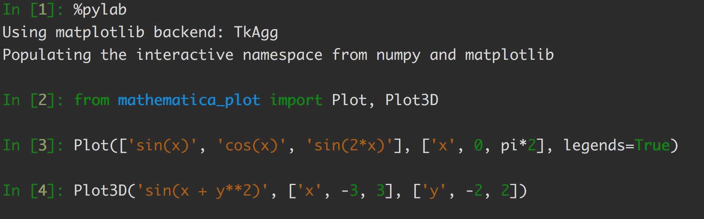
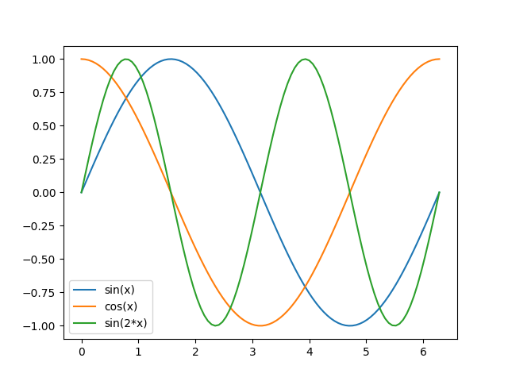
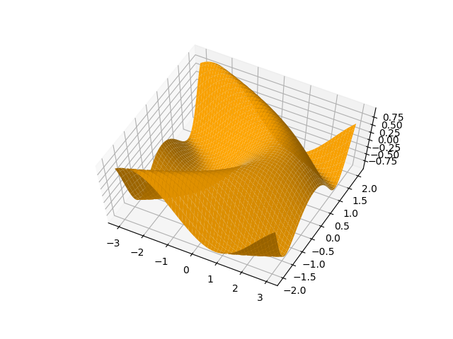
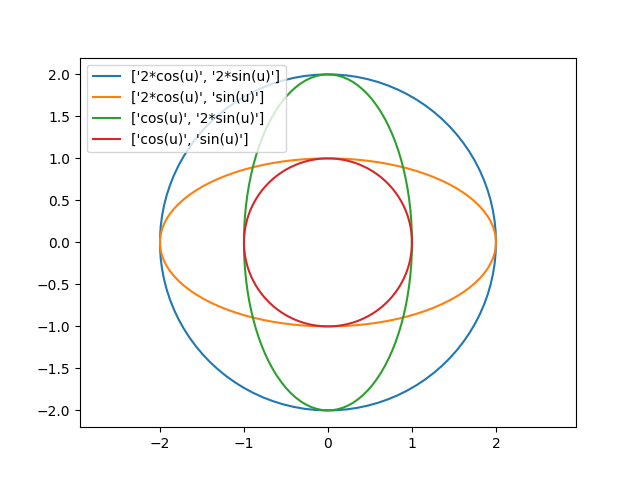
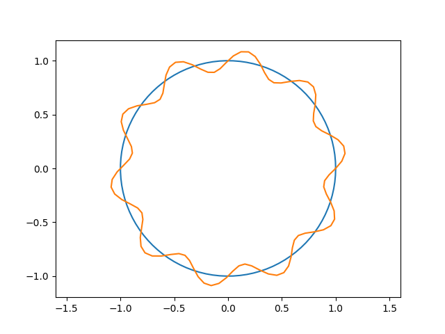

# Python Library that Makes Plot Simpler
With this library, you could plot functions like
Mathematica. Please check the [Jupyter Notebook](notebooks/examples.ipynb).

For example, the above code will generate the below plots respectively.

More examples are listed below.

